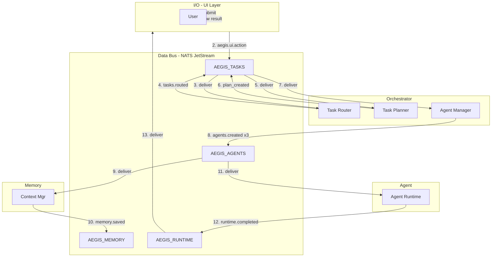
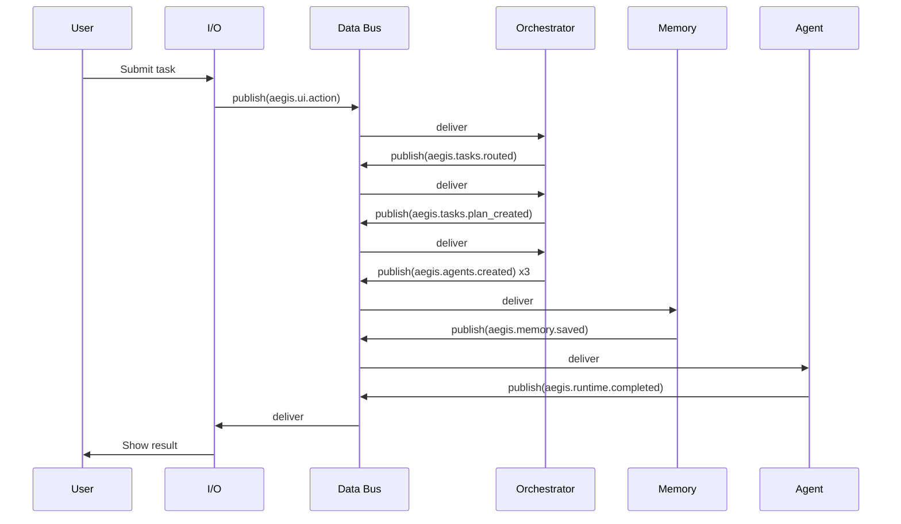

# Aegis DataBus — Visual Demo Guide

## Architecture Diagram



## Sequence Diagram



## Live Monitoring

### 1. NATS Monitoring (built-in) — Works immediately

Start the cluster, then open in your browser:

| URL | What it shows |
|-----|---------------|
| http://localhost:8222 | NATS server info |
| http://localhost:8222/varz | Server vars (version, uptime, mem) |
| http://localhost:8222/connz | **Active connections** — each component (aegis-demo, aegis-databus) |
| http://localhost:8222/subsz | Subscriptions |
| http://localhost:8222/jsz | **JetStream** — streams, message counts, bytes |

**Best for live demo:** Open `/connz` and `/jsz` in separate tabs while the demo runs — you’ll see connections and message flow update in real time.

### 2. Grafana

1. Start: `docker compose up -d`
2. Open: **http://localhost:3000**
3. Login: `admin` / `admin`
4. Prometheus is auto-provisioned.
5. Go to **Dashboards → Browse** — the **Aegis DataBus - NATS** dashboard should appear under folder **Aegis**.
6. Optional: **Dashboards → New → Import** → ID **7423** for a richer NATS dashboard.

### 3. Prometheus

- **http://localhost:9090** — query metrics
- Try: `gnatsd_varz_connections` or `gnatsd_connz_num_connections`

## Quick Start

```bash
cd aegis-databus
docker compose up -d
sleep 5
./bin/aegis-databus &
./bin/aegis-demo
```

Then open:
- **Grafana**: http://localhost:3000
- **NATS /connz**: http://localhost:8222/connz
- **NATS /jsz**: http://localhost:8222/jsz

See [MONITORING.md](../MONITORING.md) for full live monitoring instructions.

## Port Reference

| Port | Service |
|------|---------|
| 4222 | NATS client (nats-1) |
| 8222 | NATS monitoring (nats-1) |
| 8223 | NATS monitoring (nats-2) |
| 8224 | NATS monitoring (nats-3) |
| 9090 | Prometheus |
| 3000 | Grafana |
