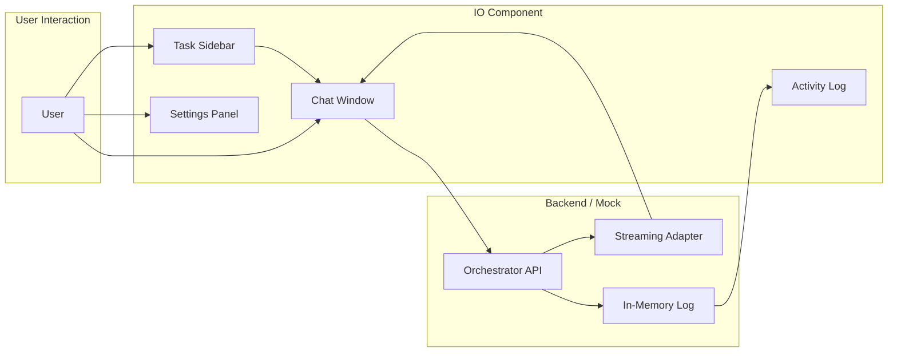
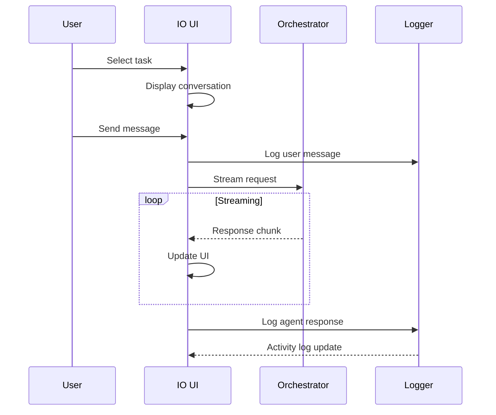

# IO Component Architecture - Midterm Slides

## Overview Diagram

## Component Responsibilities

### Task Sidebar
- Lists all agent tasks sorted by urgency
- Shows task status: awaiting feedback, working, completed
- Displays heartbeat timer for working tasks
- Search and filter functionality

### Chat Window
- Displays conversation history with the agent
- Real-time streaming of agent responses
- Quick-reply suggestion chips for demo
- Status bar showing current task state

### Settings Panel
- Demo behavior toggles (scripted mode, streaming indicator)
- Task list preferences (sorting, heartbeat display)
- Appearance settings (font size, high contrast)
- Persists to localStorage

### Activity Log
- Real-time event feed
- Semantic heartbeats from working tasks
- User message and agent response tracking
- Demonstrates the heartbeat concept from the spec

## Data Flow

## Key Features for Demo

1. **Task Priority Sorting**: Tasks requiring feedback appear first
2. **Semantic Heartbeats**: Working tasks emit status updates every 3 seconds
3. **Streaming Responses**: Real-time character-by-character response display
4. **Demo Mode**: Pre-configured suggestion chips for smooth presentation
5. **Keyboard Shortcuts**:
   - `Ctrl/Cmd + K`: Focus chat input
   - `Alt + Up/Down`: Navigate between tasks
   - `Escape`: Close settings panel

## Tech Stack

- **React 18** with TypeScript
- **Vite** for fast HMR development
- **CSS Variables** for theming
- **LocalStorage** for settings persistence
- **Async Generators** for streaming API

## Demo Script Suggestions

1. Open dashboard - show task list with different statuses
2. Click on "awaiting feedback" task - demonstrate the urgent state
3. Send a message - watch streaming response
4. Toggle activity log - show semantic heartbeats
5. Open settings - demonstrate customization options
6. Use keyboard shortcuts for navigation
