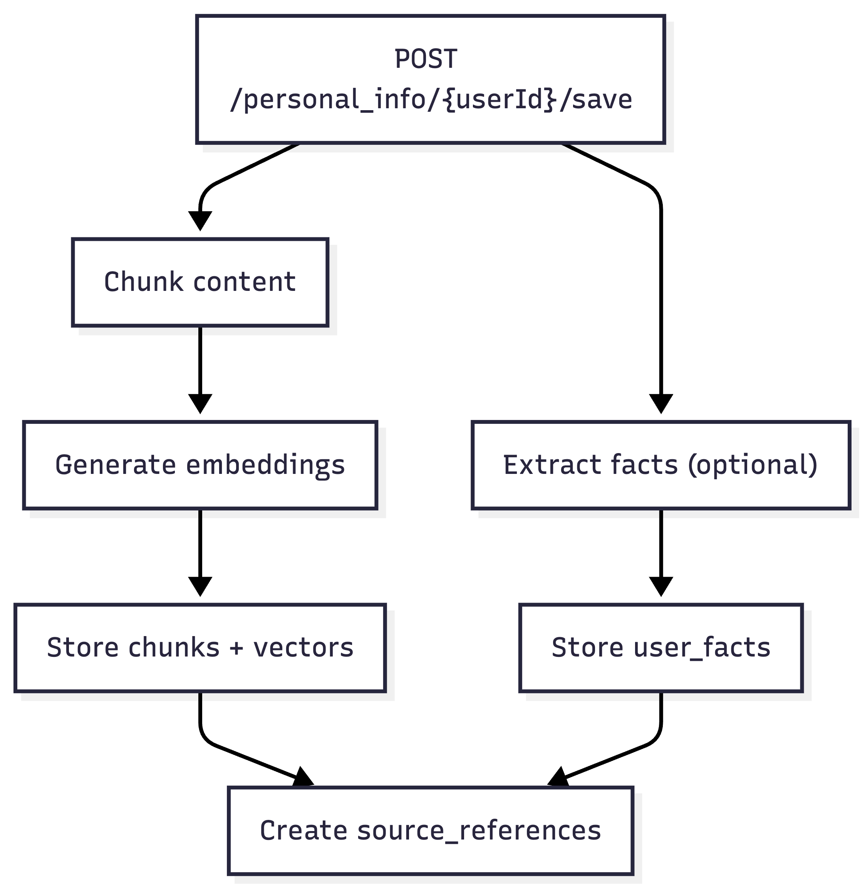
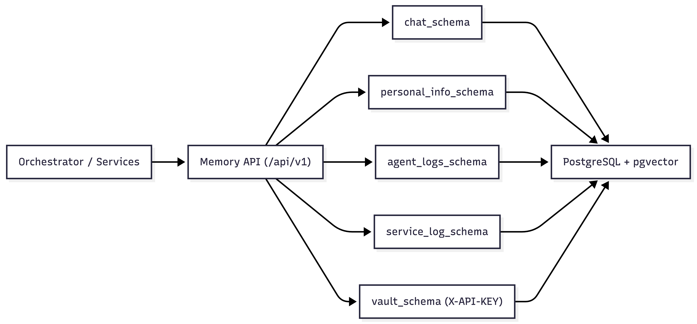
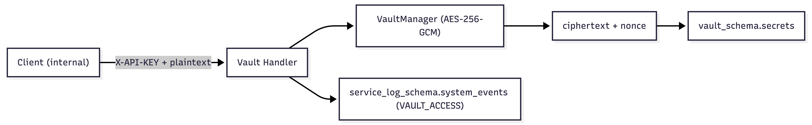

# Memory Service

## Our Design Thinking

<small>Colby Dobson and Aniket Thakker</small>
 
<small>How we decided architecture, boundaries, and tradeoffs</small>

---

## The Core Question

How do we give agents **useful memory** and provide a clean API to the other services?

> Our goal: simple API for callers, strong logic inside the memory service, don't try to handle too much.

---

## Design Lens

- API should match user intent, conforming to other service's requirements
- Schema should be future-friendly: sharding keys from day one
- Responses should be uniform: envelope + typed errors
- Ownership should be strict: user-scoped access + `not_found` masking

---

## Why a Facade API?

- We let callers send **raw text**, not chunk sizes or embedding config
- This keeps other teams fast and reduces integration bugs
- We can improve internals later without breaking API consumers
- Traceability is easier because one service owns the full pipeline

---

## Schema Design (What + Why)

- `identity_schema`: canonical users for ownership checks
- `chat_schema`: immutable conversation timeline (short-term recall)
- `personal_info_schema`: chunks + facts + source links (long-term memory)
- `agent_logs_schema`: task execution/audit trail (agent transparency)
- `service_log_schema`: operational events and diagnostics (observability)

<small>One schema per responsibility keeps boundaries clear and migrations safer.</small>

---

## Personal Info Flow

  

---

## Query and Ranking Flow

---

## Why This Covers What We Need

- Conversation recall: chat transcript
- Semantic retrieval: chunk + vector search
- Fact correction: versioned fact updates/deletes
- Source traceability: source reference links
- Agent auditability: task execution logs
- Platform observability: system events

<small>This split ensures every major memory-system use case has a clear home.</small>

---

## Retrieval Strategy

- We use `pgvector` inside Postgres so relational + semantic data stay in one system.
- We use ANN search because exact vector search gets slow as data grows.
- Query returns a ranked list of matches, and each match includes a **similarity score [0,1]**.
- Results are sorted by relevance first; if two are equally relevant, the newer one comes first for stable output.

<small>In short: one database, fast enough search, easy scores, deterministic results.</small>

---

## What These Mean In Practice

- **One DB (`pgvector` + SQL):** simpler ops, fewer sync problems.
- **ANN search:** small precision tradeoff for lower latency.
- **Score [0,1]:** easier for clients to read and threshold.
- **Tie-break by recency:** when two chunks are equally close, newer context is usually more useful.

---

## Concurrency and Correctness

- Go HTTP server handles requests concurrently (goroutine-per-request).
- DB access uses a connection pool (`pgxpool`) for safe parallel queries.
- Fact updates use optimistic concurrency (`version`) to avoid lost updates
- Retries use idempotency keys so network retries do not duplicate writes
- Mismatched retries return explicit `409 conflict`

> We prefer explicit conflict over silent overwrite.

---

## Security and Multi-Tenancy Posture

- Validate user existence on all user-scoped paths
- Constrain lookups by owner keys
- Return `not_found` to avoid cross-user information leaks
- Internal vault access protected and audited

---

## Vault Security Model

- Vault endpoints are internal-only and require `X-API-KEY` (`INTERNAL_VAULT_API_KEY`).
- Secret values are never stored as plaintext in Postgres.
- Encryption uses AES-256-GCM in the service layer (`VaultManager`).
- `VAULT_MASTER_KEY` is required at startup and kept outside the database.
- For each secret write:
  - generate a fresh nonce,
  - encrypt plaintext -> ciphertext,
  - store ciphertext + nonce in `vault_schema.secrets`.
  - Every vault access is logged to `service_log_schema.system_events` as `VAULT_ACCESS`.

---

## Vault Encryption Flow

---

## Observability as a First-Class Feature

- Health endpoint for orchestrators
- System event stream for operational debugging
- Agent execution logs for decision traceability
- Response envelope standardization for client simplicity

---

## Tradeoffs We Accepted

- More complexity inside memory service, less complexity for every caller
- Strict contracts now to reduce drift later
- Naive/unoptimized implementations for the sake of simplicity early

<small>We optimized for stable interfaces first, perfect internals second.</small>

---

## Demo Set We Built

- `demo/01_health.sh`
- Shows service and database readiness.
- `demo/02_chat_idempotency.sh`
- Shows message insert, retry safety, and conflict handling.
- `demo/03_personal_info_lifecycle.sh`
- Shows save, semantic query, fact update, and fact delete.
- `demo/04_agent_logs.sh`
- Shows task execution timeline write/read.
- `demo/05_system_and_vault.sh`
- Shows system telemetry + vault access control behavior.

---

## Upcoming Features

- Certificate store (managed cert metadata and secure references)
- CLI experience for memory/vault operations and diagnostics
- Skills store for reusable agent capabilities and metadata
- General document store so other services can persist arbitrary docs/notes they need
- Additional hardening, observability, and orchestration integrations
- And much, much more as the AI OS platform expands

<small>Design goal: keep one coherent memory/security platform while adding new capability domains.</small>

---

## What The Demos Prove

- API contracts are usable end-to-end from a client perspective.
- Core data paths work: chat, memory, facts, agent logs, system logs.
- Guardrails work where expected:
- idempotency conflict detection
- optimistic concurrency behavior
- vault key enforcement
- The service is explainable in a live walkthrough, not just in docs.

<small>Run sequence: `demo/00_prepare.sh` then `demo/run_all.sh`.</small>

---

# Final Principle

## Memory should feel simple to call,

## but deliberate under the hood.

<small>Our principle: trustworthy behavior first, then feature expansion.</small>
